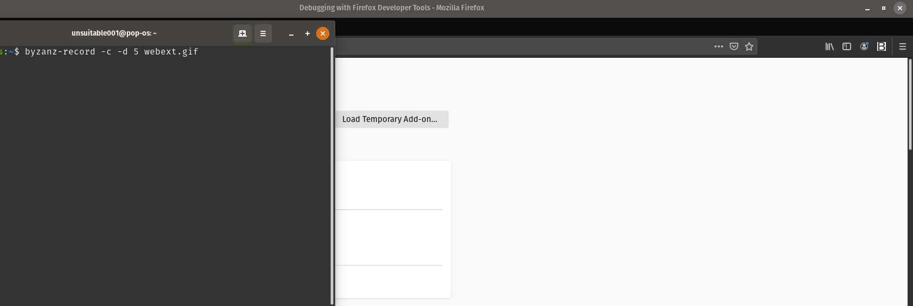
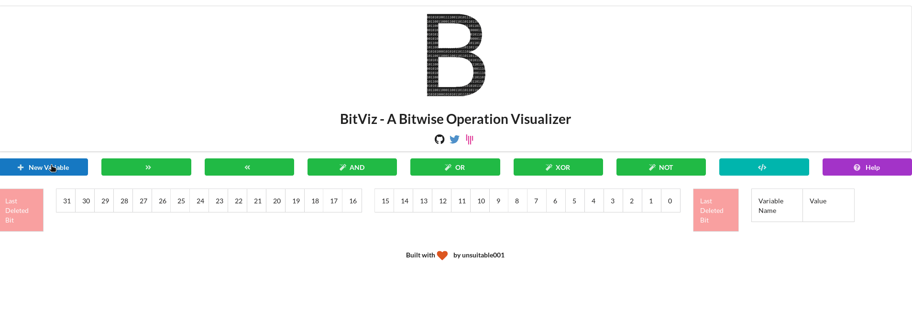
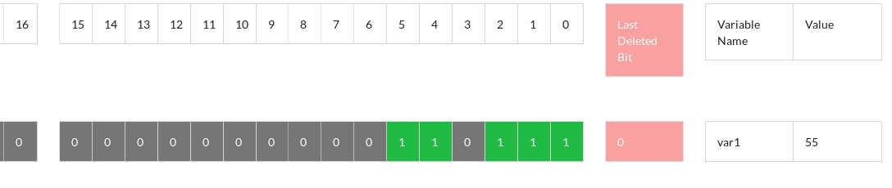
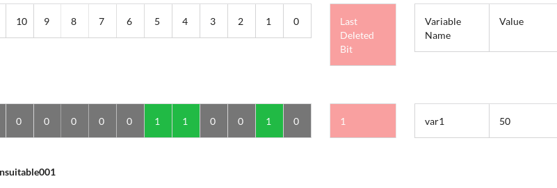
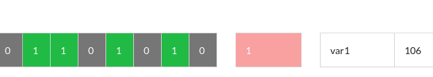
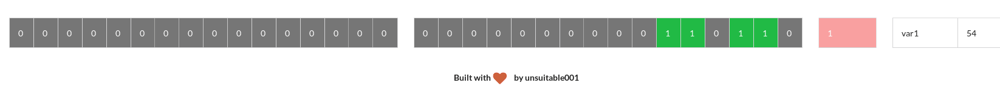
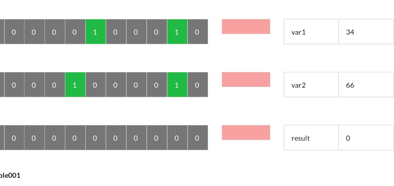
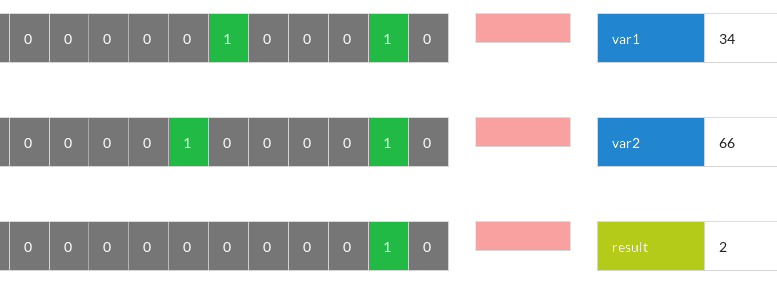
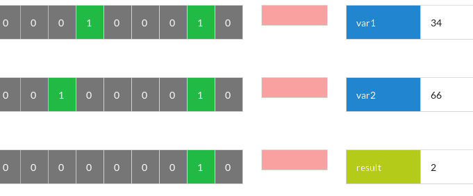
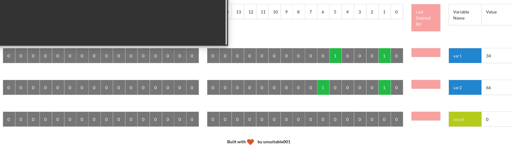

<p align="center">

</p>

# BitViz
A Bitwise Operation Visualizer - casting the beauty of fiddling bits on your screen.

## Build

If you want to build a binary for your platform, do this :

```bash
yarn install
yarn build
```

Binary will be in the `dist` folder

## Installation
* [Live Website](https://unsuitable001.github.io/BitViz) - no installation required
* Firefox Addon - [See Manual Installation Guide](https://extensionworkshop.com/documentation/develop/temporary-installation-in-firefox/) - (I'm trying my best to make it available in Mozilla Addon Store)
* Chrome Extension - [See Manual Installation Guide](https://webkul.com/blog/how-to-install-the-unpacked-extension-in-chrome/) - (I'm trying my best to make it available in Chrome Web Store)

*Firefox Addon & Chrome Extension works offline. Working on making standalone app for Windows, Linux & Mac.*

## Getting Started

### Launch Firefox/Chrome App

<p align="center">

</p>

### Adding A New Variable

<p align="center">

</p>

### Selecting A Variable

There are two types of selection in BitViz.

Primary Selection - Single Click the variable name to primary select that variable - Single Click to deselect

Secondary Selection - Double Click the variable name to secondary select that variable - Double Click to deselect

*If you are doing self-assignment operation (e.g NOT, Left Shift, Right Shift etc.), it will be implied upon the "Primary Selected" variable.*

*Else, The operation is done on the "Primary Selected" variables, but, the value will be assigned to the "Secondary Selected" variable.*

## Features

<p align="center">

 Left & Right Shift
</p>

<p align="center">

Increment by 1
</p>


<p align="center">

<br>Decrement by 1
</p>


<p align="center">

 NOT
</p>

<p align="center">
<br>AND
</p>

<p align="center">
<br>OR
</p>

<p align="center">
<br>XOR
</p>

<p align="center">
<br>Basic Maths Operations
</p>

## Legends & Keybindings

<p align="center">

</p>

### More Keybindings

* Delete variables -> D
* Equalizing two variables ->     = (from primary to secondary selection)
* Multiplying between variables ->    *
* Adding between variables ->     +
* Dividing between variables ->     /
* Subtracting between variables ->    -

### This project is under MIT License

## Author

Soumyadip Mondal(unsuitable001)

## Credits

A tiny part of Semantic-UI is used to build the UI.

[@newvertex](https://github.com/newvertex) for modals & packing it as electron app.

## Connect With Me

[Gitter](https://gitter.im/unsuitable001)

[Twitter](https://twitter.com/unsuitable001)

[Website](https://unsuitable001.github.io)

### Thanks for checking out. Please put a star :P. Share It, Fork It.
